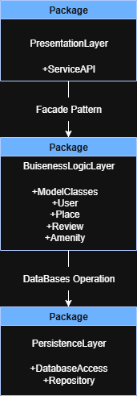
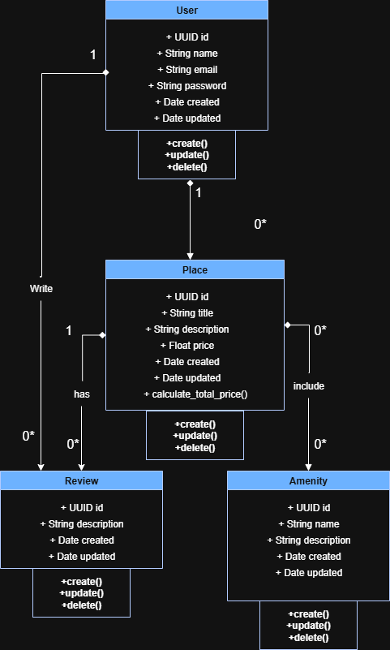

### Package Diagram

### Description du diagramme

### PresentationLayer (Couche de présentation)

Contient l’API de service (+ServiceAPI).

C’est l’interface entre l’utilisateur (ou une application cliente) et le système.

Elle utilise un Facade Pattern pour simplifier l’accès aux fonctionnalités de la couche métier.

### BusinessLogicLayer (Couche métier)

Contient les classes modèles principales :

User

Place

Review

Amenity

Cette couche gère la logique métier et applique les règles de traitement.

Elle communique avec la couche de persistance pour gérer les opérations sur la base de données.

### PersistenceLayer (Couche de persistance)

Contient les mécanismes d’accès aux données (+DatabaseAccess, +Repository).

Responsable de la gestion de la base de données : lecture, écriture, mise à jour, suppression.

Fournit les données nécessaires à la couche métier.

### Class Diagram

### Classe User

Représente un utilisateur de l’application.

Attributs :

UUID id : identifiant unique de l’utilisateur

String name : nom de l’utilisateur

String email : adresse e-mail

String password : mot de passe

Date created : date de création du compte

Date updated : date de mise à jour du compte

Méthodes :

create()

update()

delete()

Relations :

Un utilisateur peut posséder plusieurs lieux (owns).

Un utilisateur peut écrire plusieurs avis (writes).

### Classe Place

Représente un lieu proposé dans l’application.

Attributs :

UUID id : identifiant unique du lieu

String title : titre du lieu

String description : description du lieu

Float price : prix du lieu

Date created : date de création

Date updated : date de mise à jour

Méthodes :

create()

update()

delete()

calculate_total_price() : calcule le prix total (par exemple en fonction de la durée ou des options).

Relations :

Un lieu est possédé par un utilisateur.

Un lieu peut recevoir plusieurs avis (has).

Un lieu peut inclure plusieurs commodités (includes).

### Classe Review

Représente un avis laissé par un utilisateur sur un lieu.

Attributs :

UUID id : identifiant unique de l’avis

String description : contenu de l’avis

Date created : date de création

Date updated : date de mise à jour

Méthodes :

create()

update()

delete()

Relations :

Un avis est écrit par un utilisateur.

Un avis est associé à un lieu.

### Classe Amenity

Représente une commodité ou un service proposé dans un lieu (ex. Wi-Fi, piscine, parking).

Attributs :

UUID id : identifiant unique de la commodité

String name : nom de la commodité

String description : description de la commodité

Date created : date de création

Date updated : date de mise à jour

Méthodes :

create()

update()

delete()

Relations :

Une commodité peut être incluse dans plusieurs lieux.