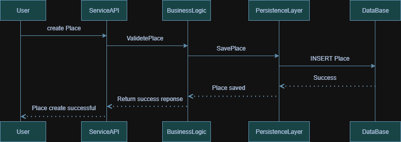
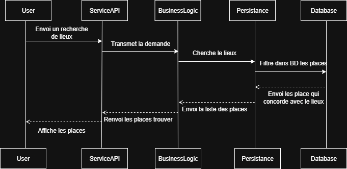

### High-Level Package Diagram

### Description du diagramme

### PresentationLayer

Contient ServiceAPI.

C’est l’interface entre l’utilisateur et le système.

Elle utilise un Facade Pattern pour simplifier l’accès aux fonctionnalités de la couche métier.

### BusinessLogicLayer

Contient les classes modèles principales :

User

Place

Review

Amenity

Cette couche gère la logique métier et applique les règles de traitement.

Elle communique avec la couche de persistance pour gérer les opérations sur la base de données.

### PersistenceLayer

Contient les mécanismes d’accès aux données (+DatabaseAccess, +Repository).

Responsable de la gestion de la base de données : lecture, écriture, mise à jour, suppression.

Fournit les données nécessaires à la couche métier.

### Class Diagram

### Class User

Représente un utilisateur de l’application.

Attributs :

UUID id : identifiant unique de l’utilisateur

String name : nom de l’utilisateur

String email : adresse e-mail

String password : mot de passe

Date created : date de création du compte

Date updated : date de mise à jour du compte

Méthodes :

create()

update()

delete()

Relations :

Un utilisateur peut posséder plusieurs lieux.

Un utilisateur peut écrire plusieurs avis.

### Class Place

Représente un lieu proposé dans l’application.

Attributs :

UUID id : identifiant unique du lieu

String title : titre du lieu

String description : description du lieu

Float price : prix du lieu

Date created : date de création

Date updated : date de mise à jour

Méthodes :

create()

update()

delete()

calculate_total_price() : calcule le prix total (par exemple en fonction de la durée ou des options).

Relations :

Un lieu est possédé par un utilisateur.

Un lieu peut recevoir plusieurs avis.

Un lieu peut inclure plusieurs commodités.

### Class Review

Représente un avis laissé par un utilisateur sur un lieu.

Attributs :

UUID id : identifiant unique de l’avis

String description : contenu de l’avis

Date created : date de création

Date updated : date de mise à jour

Méthodes :

create()

update()

delete()

Relations :

Un avis est écrit par un utilisateur.

Un avis est associé à un lieu.

### Class Amenity

Représente une commodité ou un service proposé dans un lieu (ex. Wi-Fi, piscine, parking).

Attributs :

UUID id : identifiant unique de la commodité

String name : nom de la commodité

String description : description de la commodité

Date created : date de création

Date updated : date de mise à jour

Méthodes :

create()

update()

delete()

Relations :

Une commodité peut être incluse dans plusieurs lieux.

### User Registration:

User → API : l’utilisateur envoie sa requête d’inscription avec ses infos (nom, email, mot de passe…).

API → BusinessLogic : l’API transmet les données à la couche métier pour validation (par ex. vérifier que l’email n’est pas déjà utilisé, que le mot de passe respecte les règles…).

BusinessLogic → PersistenceLayer : si tout est bon, la couche métier demande à la persistance d’enregistrer le nouvel utilisateur.

PersistenceLayer → Database : la persistance exécute une requête INSERT pour stocker les données.

Database → PersistenceLayer : la base confirme que l’insertion s’est bien passée.

PersistenceLayer → BusinessLogic : la couche de persistance informe que l’utilisateur a été enregistré.

BusinessLogic → API : la logique métier renvoie un résultat positif.

API → User : l’API répond au client : Registration Successful.

### Place Creation:

User → API : l’utilisateur envoie une requête pour créer un nouveau lieu avec ses infos (titre, description, prix…).

API → BusinessLogic : l’API transmet les données à la couche métier pour les valider.

BusinessLogic → PersistenceLayer : si la validation passe, la couche métier demande à la persistance d’enregistrer le lieu.

PersistenceLayer → Database : insertion du Place dans la base de données.

Database → PersistenceLayer : confirmation que l’insertion a réussi.

PersistenceLayer → BusinessLogic : retour indiquant que le lieu est sauvegardé.

BusinessLogic → API : envoie une réponse de succès.

API → User : l’utilisateur reçoit "Place Creation Successful".

### Review Submission:

User → API : l’utilisateur envoie un avis.

API → BusinessLogic : l’API transmet à la couche métier pour validation.

BusinessLogic → PersistenceLayer : si la validation passe, la couche métier crée un objet Review et le transmet à la persistance.

PersistenceLayer → Database : insertion de l’avis.

Database → PersistenceLayer : confirmation que l’avis a bien été enregistré.

PersistenceLayer → BusinessLogic : retour de succès.

BusinessLogic → API : la logique métier renvoie une réponse positive.

API → User : l’utilisateur reçoit "Review Submission Successful".

### Fetching a List of Places:

User → ServiceAPI
L’utilisateur envoi une recherche de lieux à l’API.

ServiceAPI → BusinessLogic
L’API transmet la demande a BusinessLogic.

BusinessLogic → Persistance
BusinessLogic demande à la couche de persistance de chercher les lieux dans la base de données.

Persistance → Database
La couche de persistance filtre les lieux dans la base de données.

Database → Persistance
La base de données retourne le résultat (la liste des places) à la couche de persistance.

Persistance → BusinessLogic
La couche de persistance transmet la liste des places récupérée à la logique métier.

BusinessLogic → ServiceAPI
La logique métier renvoie les places trouver

ServiceAPI → User
Enfin, l’API retourne la liste des places à l’utilisateur.
