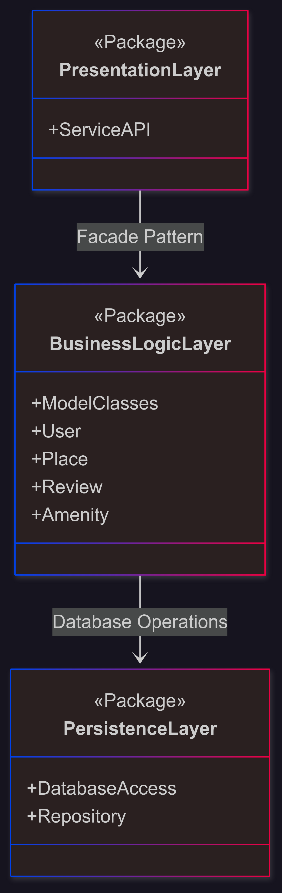

# holbertonschool-hbnb

## Description of layers

### 1. PresentationLayer
This layer is responsible for user interaction. It exposes the services and APIs that allow users to access the application's features via a simple interface.

### 2. BusinessLogicLayer
This layer contains business rules, processing logic, and core models such as User, Place, Review, and Amenity. It acts as an intermediary between the presentation and data persistence, and uses the Facade pattern to simplify interactions.

### 3. Persistence Layer
This layer manages data access, including database operations via classes such as DatabaseAccess and Repository. It handles data backup, reading, and management.
